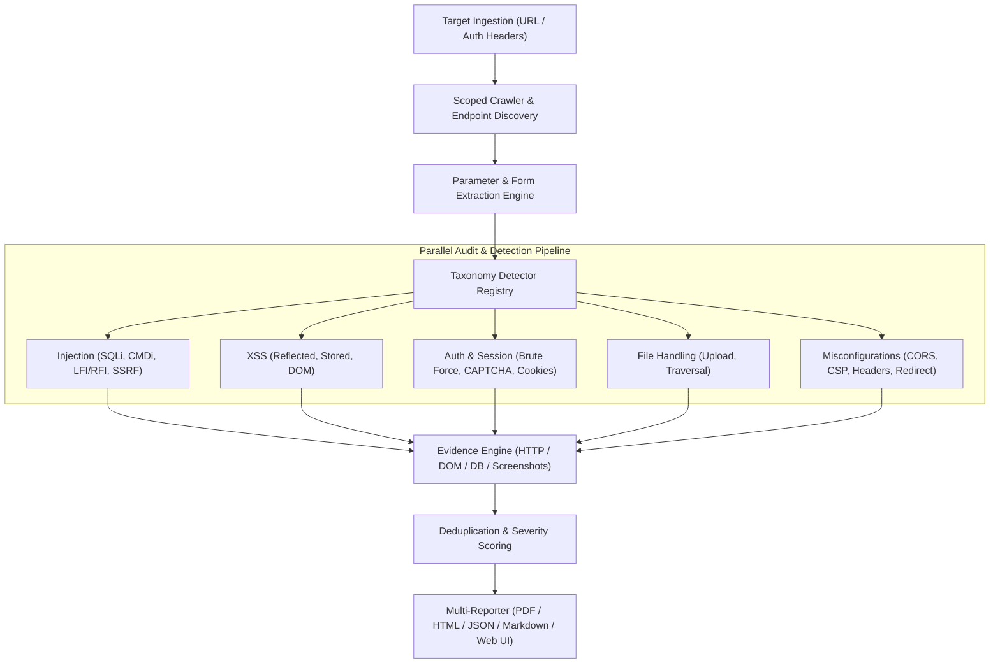
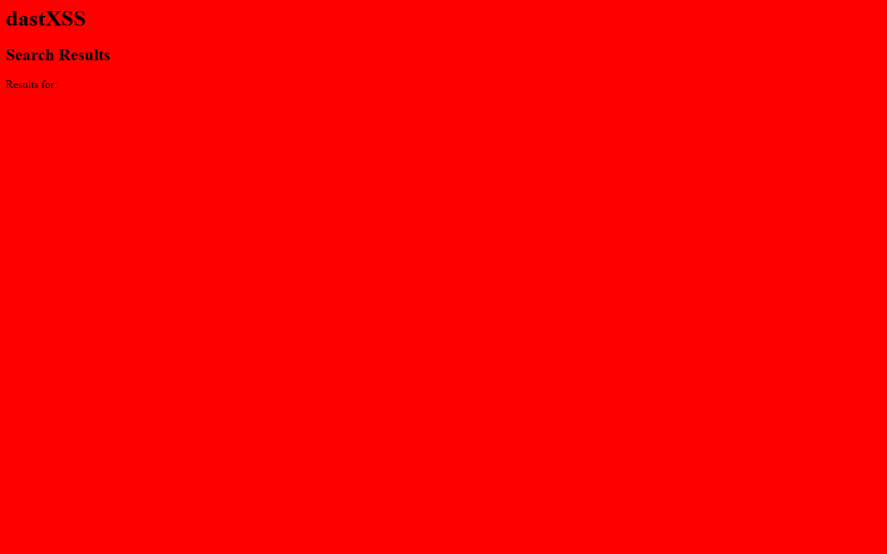
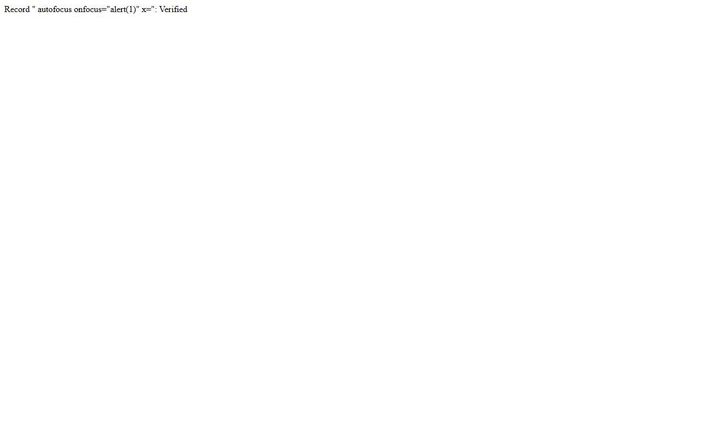
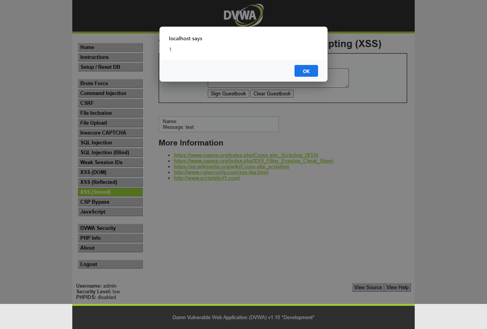
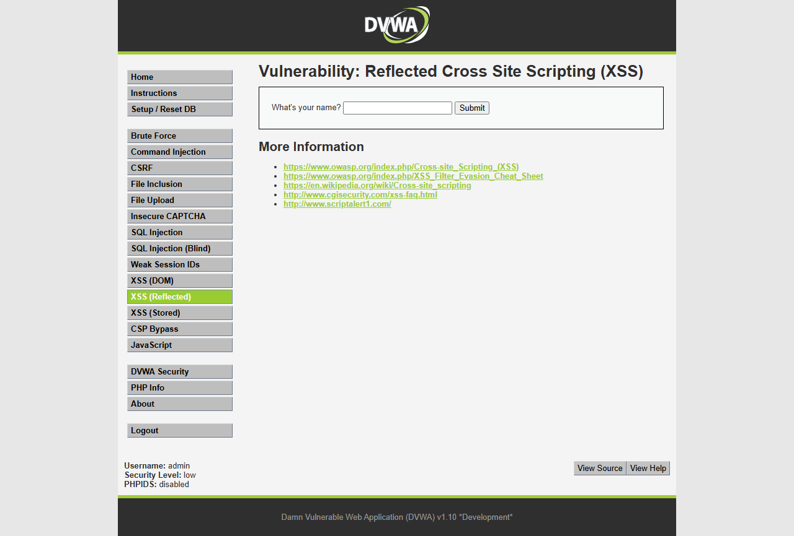

# AegisDAST — Next-Generation Modular Dynamic Application Security Testing Framework

[](https://python.org)

[](#architecture-and-how-it-works)
[](#evidence-types--proof-of-exploit)

**AegisDAST** is an enterprise-grade, modular Dynamic Application Security Testing (DAST) engine designed for automated vulnerability discovery, deep contextual crawling, and high-fidelity proof-of-exploit verification. It combines asynchronous HTTP auditing with headless browser automation (Playwright) to capture cryptographic proof, DOM mutation analysis, and visual screenshot evidence of confirmed vulnerabilities.

---

## Table of Contents

- [Project Summary](#project-summary)
- [How It Works (Architecture & Pipeline)](#how-it-works-architecture--pipeline)
- [Target Test Assets & Benchmark Suites](#target-test-assets--benchmark-suites)
- [Visual Proof of Exploitation (Finding Screenshots)](#visual-proof-of-exploitation-finding-screenshots)
- [Vulnerability Taxonomy & Evidence Matrix](#vulnerability-taxonomy--evidence-matrix)
- [Interactive Web Dashboard (GUI)](#interactive-web-dashboard-gui)
- [CLI Quickstart & Usage](#cli-quickstart--usage)
- [Multi-Format Reporting](#multi-format-reporting)
- [Testing & Quality Assurance](#testing--quality-assurance)

---

## Project Summary

Traditional dynamic scanners suffer from high false-positive rates and opaque reporting. AegisDAST solves this through:

1. **Zero-Coupling Plugin Architecture**: The scanning orchestrator (`Scanner`) contains zero vulnerability-specific logic. Detectors exist as standalone plugins registered dynamically under standard vulnerability taxonomies.
2. **Deterministic Evidence Verification**: Every finding generates concrete proof—ranging from raw DB exception signatures and differential HTTP traffic to DOM sink traces and **full-page headless browser screenshots**.
3. **Dual Execution Modes**: Operate via a comprehensive CLI for CI/CD pipelines or an interactive real-time Flask Web GUI with live Server-Sent Events (SSE) telemetry.
4. **Rich Multi-Format Reporting**: Automatically generate boardroom-ready **PDF**, interactive **HTML**, structured **JSON**, and documentation-friendly **Markdown** reports.

---

## How It Works (Architecture & Pipeline)



### Scan Execution Lifecycle

1. **Target Ingestion & Pre-flight**: Resolves network boundaries, normalizes URLs, applies authentication tokens/cookies, and validates target reachability.
2. **Autonomous Scoped Crawling**: Recursively discovers internal links, query parameters, query fragments, and HTML `<form>` elements up to configurable depths while respecting domain constraints.
3. **Dynamic Taxonomy Dispatch**: Matches discovered endpoints against registered detector plugins categorized under OWASP Top 10 classifications.
4. **Probe & Payload Execution**: Transmits non-destructive, polyglot, and canary injection payloads with automatic rate-limiting and session preservation.
5. **Headless Browser Proof-of-Exploit**: Spawns Playwright instances to render injected pages, observe DOM modifications, capture alert dialog executions, and take high-resolution PNG screenshot artifacts.
6. **Aggregation & Reporting**: Deduplicates confirmed findings, maps them to CWE/OWASP identifiers, and generates multi-format security reports.

---

## Target Test Assets & Benchmark Suites

AegisDAST has been verified and benchmarked against industry-standard vulnerable targets:

| Testing Asset | Environment | Tested Vulnerability Categories |
| :--- | :--- | :--- |
| **DVWA** *(Damn Vulnerable Web Application)* | Local / Containerized Lab | • SQL Injection (Error & Blind)<br>• Reflected & Stored XSS<br>• Command Injection<br>• File Inclusion (LFI/RFI)<br>• File Upload Controls<br>• CSRF & Session Token Entropy |
| **Altoro Mutual** (`demo.testfire.net`) | Public Benchmark Target | • Banking Application Logic Flaws<br>• Reflected Cross-Site Scripting (`/search.jsp`)<br>• SQL Injection (`/login.jsp`)<br>• Open Redirection & Leaked Endpoints<br>• Missing Security Headers & Cookie Flags |
| **Local Synthetic Lab** (`examples/local_lab.py`) | Python Test Harness | • Zero-dependency offline verification of all 18+ detector modules |

---

## Visual Proof of Exploitation (Finding Screenshots)

AegisDAST automatically captures screenshot artifacts when verifying browser-executable vulnerabilities such as Cross-Site Scripting (XSS).

### 1. Reflected Cross-Site Scripting (XSS) Proof

When canary payloads trigger script execution, Playwright intercepts DOM events and captures rendering evidence:

| Reflected Query Parameter Trigger | Injected Element Execution |
| :---: | :---: |
|  |  |

### 2. Persistent / Stored XSS Proof

Stored XSS is proven by injecting payloads into persistent input sinks (e.g., guestbooks, comments) and navigating to the viewing page with an automated browser session:

| Stored Payload Execution | Persistent Sink DOM Snapshot |
| :---: | :---: |
|  |  |

---

## Vulnerability Taxonomy & Evidence Matrix

Every finding produced by AegisDAST is paired with an exact **Evidence Type**:

```text
[Category: INJECTION]
  ├── sqli               -> [db_error]       Database syntax error signatures
  ├── blind_sqli         -> [http_traffic]   Timing & boolean-differential metrics
  ├── command_injection  -> [http_traffic]   Subshell arithmetic & delimiter execution
  ├── file_inclusion     -> [http_traffic]   System file pattern matching & PHP wrappers
  └── ssrf               -> [http_traffic]   Out-of-band & internal service response reflection

[Category: XSS]
  ├── xss (Reflected)    -> [screenshot]     Playwright headless browser execution screenshot
  ├── stored_xss         -> [screenshot]     Multi-step persistent canary render screenshot
  └── dom_xss            -> [dom_evidence]   Client-side JavaScript source-to-sink AST analysis

[Category: BROKEN_AUTH]
  ├── brute_force        -> [terminal_output] Missing rate-limiting / lockout detection
  └── insecure_captcha   -> [dom_evidence]    Client-side only CAPTCHA validation

[Category: COOKIE_BASED]
  ├── cookies            -> [terminal_output] Secure, HttpOnly, and SameSite flag inspection
  ├── csrf               -> [dom_evidence]    Missing anti-CSRF tokens on state-changing POSTs
  └── weak_session_ids   -> [terminal_output] Shannon entropy & token predictability scoring

[Category: FILE_HANDLING]
  └── file_upload        -> [dom_evidence]    Missing MIME/extension constraints on file uploads

[Category: MISCONFIGURATION]
  ├── cors               -> [http_traffic]    Insecure wildcard & null origin reflection
  ├── csp_bypass         -> [terminal_output] Unsafe Content Security Policy directives
  ├── javascript         -> [dom_evidence]    Leaked secrets, API keys & exposed source maps
  ├── open_redirect      -> [http_traffic]    Arbitrary location header redirection
  └── security_headers   -> [http_traffic]    Missing HSTS, X-Frame-Options, CSP, etc.
```

---

## Interactive Web Dashboard (GUI)

AegisDAST includes a built-in Flask web application providing a graphical security operations cockpit:

- **Live Progress & Milestone Tracking**: Monitor real-time status (Reachability → Crawling → Pentesting → Reporting) via Server-Sent Events (SSE).
- **Interactive Vulnerabilities Explorer**: Filter and inspect findings by severity, category, and evidence type.
- **Visual Proof Viewer**: Embedded browser modal for exploring captured screenshots.
- **One-Click Multi-Format Export**: Download PDF, HTML, JSON, and Markdown reports directly from the interface.

### Launching the Web GUI

```bash
python -m dast.gui.app
```
*Access the dashboard at `http://127.0.0.1:5000` in your web browser.*

---

## CLI Quickstart & Usage

### 1. Installation

```bash
# Clone the repository
git clone https://github.com/your-username/aegis-dast.git
cd aegis-dast

# Install Python dependencies
pip install -r requirements.txt

# Install Playwright browser binaries for visual screenshot capture
playwright install chromium
```

### 2. Basic Scan

```bash
python -m dast.cli http://127.0.0.1:8765 --output dast-report.json
```

### 3. Targeted Category & Browser Proof Scan

```bash
# Run XSS detection with Playwright headless browser screenshots
python -m dast.cli http://127.0.0.1:8765 -c xss --browser

# Run Injection & Broken Authentication scans with custom auth headers
python -m dast.cli http://127.0.0.1:8765 -c injection,broken_auth -H "Authorization: Bearer <TOKEN>"
```

### 4. CLI Argument Reference

| Flag | Full Option | Description | Default |
| :--- | :--- | :--- | :--- |
| `url` | `URL` | Target web application root URL | *Required* |
| `-o` | `--output` | Destination path for JSON report | `dast-report.json` |
| `-c` | `--category` | Vulnerability taxonomy filter (`injection`, `xss`, `broken_auth`, `cookie_based`, `file_handling`, `misconfiguration`) | All |
| `-d` | `--detectors`| Specific comma-separated detector names | `all` |
| | `--browser` | Enable Playwright for visual screenshot capture | `False` |
| | `--browser-dir` | Output directory for screenshot evidence | `evidence/screenshots` |
| | `--max-depth` | Maximum recursive crawl depth | `2` |
| | `--max-pages` | Maximum pages to discover and audit | `20` |
| | `--delay` | Inter-request rate limit delay (seconds) | `0.0` |
| | `--timeout` | HTTP request timeout in seconds | `10.0` |
| `-H` | `--header` | Custom HTTP headers (`"Name: Value"`) | None |
| | `--list-detectors` | Print all registered detector plugins | `False` |

---

## Multi-Format Reporting

AegisDAST compiles comprehensive security reports suited for both engineers and executives:

- **Executive PDF Report** (`dast-report.pdf`): Styled assessment overview with executive summary, severity distribution charts, and finding details.
- **Interactive HTML Report** (`dast-report.html`): Filterable dynamic web report with embedded screenshot proofs and code snippets.
- **Structured JSON Report** (`dast-report.json`): Machine-readable export for SIEM, defect tracking, and CI/CD automation.
- **Markdown Documentation** (`dast-report.md`): Formatted documentation for repository wikis and bug tickets.

---
## Testing & Quality Assurance

AegisDAST includes a full automated test suite covering unit behaviors, detector plugins, mock HTTP requests, and integration flows:

```bash
# Run pytest suite
python -m pytest -v
```

All tests run deterministically with zero external internet dependencies.
